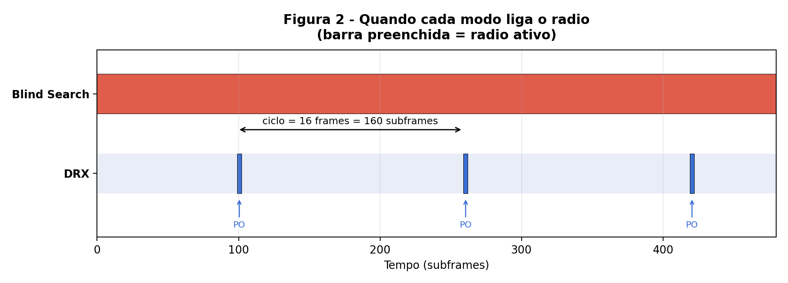
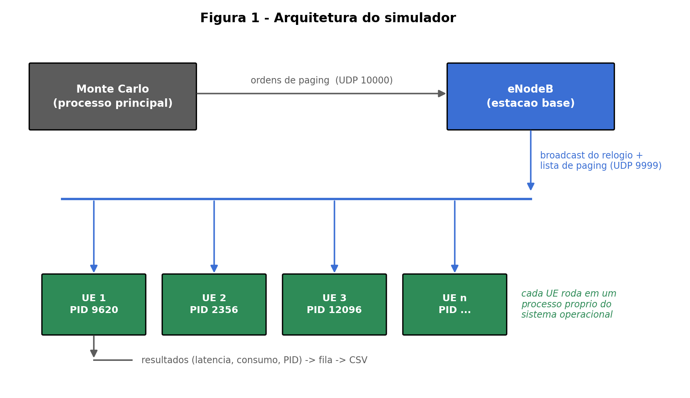
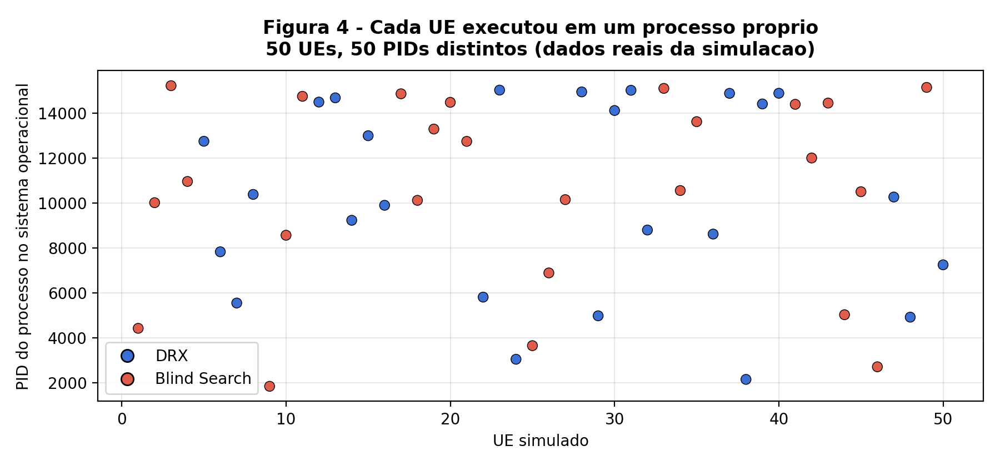
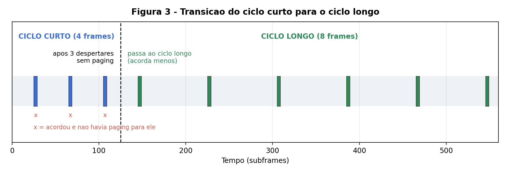
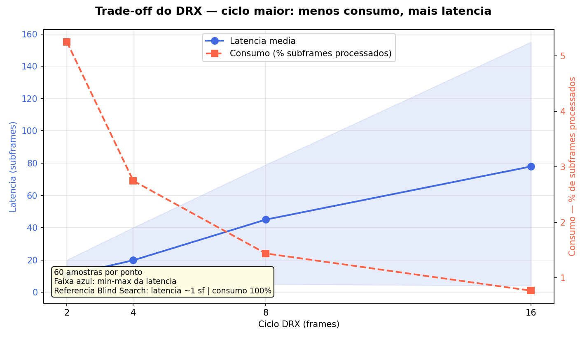
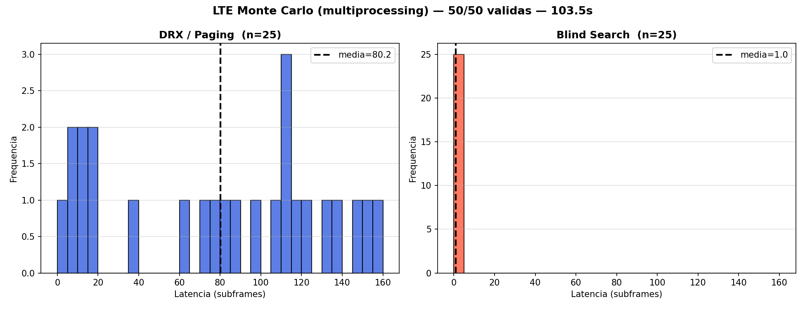

# Simulador de Paging e DRX em redes LTE/5G

Simulador distribuído que reproduz o procedimento de **paging** (a chamada que a
rede faz a um celular) e o mecanismo de **DRX** (*Discontinuous Reception*, a
economia de bateria que faz o rádio dormir entre despertares programados).

Cada equipamento de usuário roda em um **processo independente** do sistema
operacional e escuta a estação base por UDP, o que permite medir, em escala, o
compromisso central das redes celulares: **quanto de latência se paga por cada
unidade de bateria economizada**.

Desenvolvido no âmbito do Programa de Iniciação Científica (PIC) da
Universidade Federal Rural de Pernambuco.

---

## O problema em uma imagem

Um celular precisa estar pronto para receber uma chamada a qualquer momento.
A forma ingênua é manter o rádio sempre ligado (*Blind Search*): a chamada chega
na hora, mas a bateria acaba. O DRX resolve fazendo o aparelho dormir e acordar
apenas em instantes calculados a partir do seu IMSI — as *Paging Occasions*.



A barra vermelha contínua é o rádio sempre ligado. Os três traços azuis são o
DRX: o aparelho acorda **um único subframe** a cada ciclo e dorme o resto do
tempo. É por isso que o consumo cai de 100% para cerca de 1%.

---

## Arquitetura



| Componente | Arquivo | Papel |
|---|---|---|
| Estação base | `enodeb.py` | Transmite o relógio da rede (SFN/subframe) e a lista de paginações em *broadcast* UDP |
| Equipamento de usuário | `ue.py` | Escuta o rádio, calcula suas *Paging Occasions* e decide quando acordar |
| Orquestrador | `monte_carlo.py` | Cria N processos de UE, dispara as paginações e coleta os resultados |
| Estudo paramétrico | `varredura.py` | Repete campanhas variando o ciclo DRX e levanta a curva de trade-off |
| Figuras | `gerar_figuras.py` | Gera os diagramas explicativos deste README |

Cada UE abre o **próprio socket** na porta de *broadcast*. Isso é possível
graças à opção de reuso de endereço, que faz todos os sockets receberem cópia da
mesma mensagem — espelhando o meio físico compartilhado de uma célula real e
dispensando qualquer distribuidor central de pacotes.

O paralelismo é **auditável**: o PID de cada processo é registrado nos
resultados.



---

## Como rodar

Requisito: Python 3.10 ou superior.

```bash
pip install -r requirements.txt
```

O simulador precisa de **dois terminais**, e a ordem importa — sem a estação
base no ar, os UEs não têm o que escutar.

**Terminal 1 — estação base** (deixe rodando):

```bash
python enodeb.py
```

**Terminal 2 — escolha uma campanha:**

```bash
python monte_carlo.py     # compara DRX e Blind Search
```

```bash
python varredura.py       # varre os ciclos e levanta a curva de trade-off
```

```bash
python ue.py 12345 1 16 32 3    # um único UE, para inspeção manual
```

Os argumentos do UE são: IMSI, modo (`1` = DRX, `2` = Blind), ciclo curto, ciclo
longo e limite de despertares antes da transição.

Para regenerar os diagramas do README:

```bash
python gerar_figuras.py
```

### Ajustando os experimentos

Os parâmetros ficam no topo de cada arquivo. Em `monte_carlo.py`:

```python
QTD_UES_TOTAL = 50    # população da campanha
TAMANHO_LOTE  = 8     # processos simultâneos (≈ número de núcleos)
FRACAO_DRX    = 0.5   # metade DRX, metade Blind Search
DRX_BASE = DRXConfig(short_cycle=16, long_cycle=32, limite_curto=3)
```

Em `varredura.py`:

```python
VALORES       = [2, 4, 8, 16]   # ciclos a avaliar (cada um é uma campanha)
UES_POR_PONTO = 20
REPETICOES    = 3               # repete a varredura e agrupa as amostras
```

---

## O mecanismo DRX

O UE começa no **ciclo curto**, que favorece a resposta rápida logo após
atividade. A cada despertar em que **não** encontra paginação para si, um
contador avança; ao atingir o limite, ele migra para o **ciclo longo** e passa a
acordar com menos frequência, economizando mais bateria.



Encontrar a paginação caracteriza atividade e **não** avança o contador, em
conformidade com o temporizador `drxShortCycleTimer` da especificação MAC
(3GPP TS 36.321). O instante de despertar segue o cálculo normativo de
*Paging Frame* e *Paging Occasion* do 3GPP TS 36.304, derivado do IMSI.

---

## Resultados

A varredura sobre o tamanho do ciclo produz a curva de compromisso. Três
execuções independentes, 60 amostras por configuração, sem falhas por tempo
limite:

| Ciclo DRX (frames) | Latência média (sf) | Previsão analítica | Consumo (%) | Previsão analítica |
|---|---|---|---|---|
| 2  | 10,5 | 10 | 5,25 | 5,00 |
| 4  | 19,8 | 20 | 2,75 | 2,50 |
| 8  | 45,0 | 40 | 1,44 | 1,25 |
| 16 | 77,9 | 80 | 0,77 | 0,63 |



Os valores medidos aderem ao modelo analítico do protocolo: a latência média
corresponde a **metade do ciclo** e o consumo à razão de **um despertar por
ciclo**. Na prática, cada duplicação do ciclo reduz o consumo à metade e dobra a
latência média.

Comparando os dois modos diretamente, com ciclo de 16 frames:



O Blind Search recebe a paginação em cerca de 1 subframe, ao custo de processar
100% do tempo. O DRX distribui-se uniformemente ao longo do ciclo, com média em
torno de 80 subframes, mas processa menos de 1% dos subframes.

### Rigor de medição

Duas decisões evitam um viés que aparece naturalmente neste tipo de experimento:

- **Aquecimento**: o UE escuta vários ciclos completos antes que a paginação
  possa chegar. Sem isso, a janela de observação termina no primeiro ou segundo
  despertar e o estimador de consumo fica inflado em duas a três vezes.
- **Fator congelado**: a transição entre ciclos é desativada durante a
  varredura, garantindo que o parâmetro sob teste permaneça constante ao longo
  de toda a medição.

---

## Dados

| Arquivo | Conteúdo |
|---|---|
| `resultados_simulacao.csv` | Uma linha por UE da campanha: PID, IMSI, modo, latência, consumo, ciclos e estado final |
| `resultados_varredura.csv` | Agregado por ciclo: n, média, mediana, mínimo, máximo e consumo |
| `varredura_bruto.csv` | Todas as amostras individuais da varredura, com repetição e PID |

---

## Limitações e próximos passos

O consumo é medido como **fração de subframes processados**, um substituto de
tempo de rádio ativo — não uma medida direta de energia. Converter esse número
em bateria exige pesos relativos por estado do rádio (dormência profunda,
monitoramento do canal de controle, recepção e transmissão), que a literatura e
os documentos do 3GPP (TR 38.840) disponibilizam apenas em unidades relativas.

Está em curso a articulação com profissionais da indústria de telecomunicações
para obter essas razões a partir de medições de dreno de corrente em aparelhos
reais, o que permitiria confrontar diretamente as curvas do simulador com dados
de hardware.

Também permanece em aberto a incorporação de modelos de mobilidade ao cenário
simulado, prevista no projeto de pesquisa.

---

## Referências

- 3GPP TS 36.304 — *E-UTRA; User Equipment (UE) procedures in idle mode*
- 3GPP TS 36.321 — *E-UTRA; Medium Access Control (MAC) protocol specification*
- 3GPP TR 38.840 — *Study on User Equipment (UE) power saving in NR*

---

## Licença

MIT — veja [LICENSE](LICENSE).
